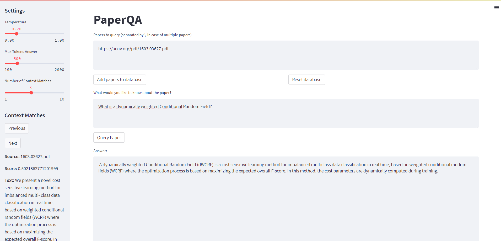

# PaperQA

This is an exemplary project for a Streamlit web app that runs a Haystack Question Answering Pipeline for Arxiv papers
using OpenAI. The purpose of this app is to demonstrate how information retrieval based on a defined document database
can be done. Additionally, it provides an example of how a Dockerized application can be easily deployed on AWS,
including authentication and a custom domain using Terraform. For business inquiries, please send an email
to [ekohlmeyer21@gmail.com](mailto:ekohlmeyer21@gmail.com).



## How it works

### Initial Settings

The configuration file can be found under `src/config.yaml`. The available settings can be found
in `paperqa/settings.py`.

### Add Papers to Database

To add Arxiv papers to your database, please insert a comma-separated string of PDF URLs into the upper text area. Once
you click on the "Add papers to database" button, a FAISS vector database will be created using the specified embedding
model.

### Reset Database

To reset your database, simply click on "Reset database". This will remove all your downloaded papers as well as the
FAISS database.

### Query Paper

Type your question into the text area above the "Query paper" button. Once you click the button, matching context will
be retrieved from your vector database, and your question will be answered based on the retrieved context.

### Adjust Settings

Feel free to adjust the following settings in the left side bar:

* `Temperature`: How deterministic should the model's answer be? (Low temperature = more deterministic, high temperature
  = less deterministic)
* `Max Tokens Answer`: How many tokens should the model generate in your answer? (Keep in mind the max tokens
  limitations of the model used)
* `Number of Context Matches`: How many context matches should be used to answer your question? (Keep in mind the max
  tokens limitations of the model used)

You also have the option to skip through the context to see what the model's answer is referring to. The score shows the
similarity between the question and the retrieved context information. The higher the score, the better the match.

## Build & Run the Application

To build the image, run the following command:

```bash
docker build -t paperqa .
```

For running the container locally, you will need to set some environment variables. The deployment of the app in AWS ECS
handles the environment independently.

### Local Deployment

#### Linux / MacOS:

```bash
docker run -p 8501:8501 -it \
-e OPENAI_API_KEY=$OPENAI_API_KEY \
paperqa 
```

#### Windows:

```shell
docker run -p 8501:8501 -it `
-e OPENAI_API_KEY=$env:OPENAI_API_KEY `
paperqa 
```

The app is available at http://localhost:8501/

### AWS Cloud Deployment

For the deployment on AWS, I added Infrastructure As Code (IAC) using terraform. I decided to include this in the scope
of this project, because I found myself looking for information on such a deployment on the internet and did not find a
comprehensive guide. The solution provided should run as is after following the steps mentioned below. The deployment
includes

* **Networking**
* **Application Load Balancing**
* **AWS Cognito Authentication**
* **Route53 Domain Management**
* **Cloudwatch Logging**
* **ECS Containerized Deployment**

Here is a short overview of the architecture (
See [here](https://aws.amazon.com/de/blogs/containers/securing-amazon-elastic-container-service-applications-using-application-load-balancer-and-amazon-cognito/
) for more details):


#### Step-by-Step Guide

1. Register your domain in
   Route53 ([Documentation](https://docs.aws.amazon.com/Route53/latest/DeveloperGuide/domain-register.html))
2. Request a SSL certificate for your application's domain in AWS Certificate
   Manager ([Documentation](https://docs.aws.amazon.com/acm/latest/userguide/gs-acm-request-public.html))
3. Validate your SSL certificate request
4. Create a secret called `paperqa_openai_api_key` with the OpenAI api key to use in the application in the AWS Secret
   Manager ([Documentation](https://docs.aws.amazon.com/secretsmanager/latest/userguide/create_secret.html))
5. Set all variables in `terraform/vars.tf`
6. Run`terraform apply` in the `terraform` directory and confirm with "yes"
7. Run `push_to_ecr.sh` to build your container and push it to ECR (Don't forget to adjust the `DOCKER_REGISTRY`
   and `IMAGE_VERSION`)
8. To update your ECS Service, run `update_ecs.sh`
9. Add a user to your Cognito user pool and remember to check the "Send an email invitation" check box
   ([Documentation] (https://docs.aws.amazon.com/cognito/latest/developerguide/managing-users.html))

## TODO

To improve the quality of the answers based on the retrieved information, the following adjustments can be made:

* Filter for files/papers in the document database to include in the information retrieval.
* Set a minimum context similarity score to ensure high-quality retrieval results.
* Output a model probability to get a sense of how deterministic the answer is.
* Perform sanity checks to ensure the generated text is verbatim in the documents and was not hallucinated.